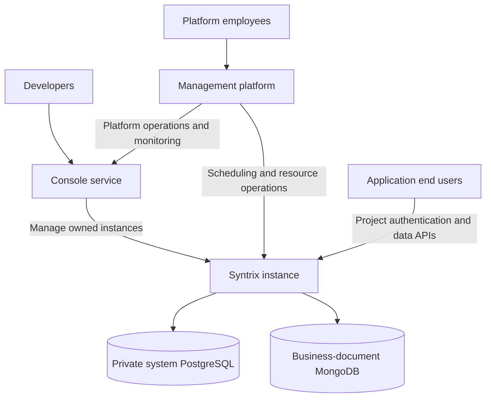
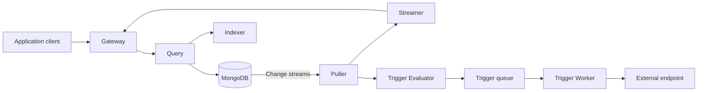

# Syntrix Platform Architecture

**Status:** Accepted target architecture. The implementation status below identifies
the runtime behavior that exists today and the remaining separation work.

This document owns the platform's user categories, service boundaries, instance
hierarchy, and database terminology. Component designs and references must use
these meanings. The [boundary decision](../.agents/notes/proposed/architecture/2026-10-10-platform-console-instance-boundaries.md)
records the rationale, alternatives, and implementation constraints.

## Users and Service Boundaries

| Layer | Users | Responsibility |
|---|---|---|
| Management platform | Syntrix platform employees | Platform-wide scheduling, resource operations, monitoring, and administration |
| Console service | Developers building services with Syntrix | Developer accounts and creation and management of each developer's Syntrix instances |
| Syntrix instance | End users of a developer's applications | Project-scoped identity, authentication, business-document access, queries, and realtime synchronization |

A developer can own one or more instances. Employees administer the platform;
developers manage their own resources through Console. Application end users
authenticate to a project inside an instance. These are distinct account and
authorization domains. An application's `admin` role does not grant Console or
Management privileges.

Management is a platform service outside developer runtime instances. Console is
the developer-facing service. An instance's Identity service manages application
end users. The existing Go `services.Manager` assembles dependencies and manages
process lifecycle; its name does not make it the Management platform.



The diagram expresses responsibility and ownership. Concrete platform APIs,
provisioning transports, and platform persistence backends require their own
designs; it does not prescribe an HTTP proxy chain for application requests.

## Instances, Projects, and Logical Databases

The hierarchy is:

```text
Developer
  Syntrix instance A
    Project shop
      Project identity realm: users, credentials, OAuth configuration, sessions
      Syntrix database orders
      Syntrix database catalog
    Project forum
      Separate project identity realm
      Syntrix database posts
  Syntrix instance B
    Its own projects, identity realms, and logical databases
```

An instance is the outer runtime and data-isolation boundary. Its projects and
application users belong to that instance. A project owns an isolated identity
realm and can use multiple logical Syntrix databases. Web, mobile, and other
OAuth clients of one project use that project's identity realm; an OAuth client
is not a separate project.

Shared project identity does not grant every user access to every project
database or document. Data access requires the target instance, project, and
database binding plus the applicable application policy. Equal usernames,
emails, role names, or database names across projects or instances do not imply
shared authority or accounts.

For example, an external identity can map to one stable local user in `shop` and
another local user in `forum`. Disabling the shop account affects its project.
Deleting `orders` leaves the shop identity realm available to `catalog`.
Deleting a project requires coordination of its identity realm and databases;
deleting an instance retires its project and runtime resources.

## Database Terminology and Data Ownership

| Term | Meaning | Data ownership |
|---|---|---|
| Instance system PostgreSQL | Private storage supporting the operation of one Syntrix instance | Projects, application end users, credentials, OAuth/OIDC providers and clients, sessions, logical-database configuration and metadata, and other system records |
| Syntrix database | The logical document-database product provided to developers | A project's business documents, accessed through Syntrix APIs and SDKs |
| Physical MongoDB database or collection | An implementation storage namespace | Holds business documents for the configured logical Syntrix databases |

Each instance contains Syntrix services, MongoDB, and PostgreSQL. PostgreSQL is
the instance's private system database; it is not a developer-facing Syntrix
database. MongoDB carries developer business documents. A logical Syntrix
database need not correspond one-to-one to a physical MongoDB database or
collection. The [storage design](design/server/core/storage/05.multi-database.md)
owns the physical representation and routing contracts.

Management's platform records and Console's developer accounts and instance
inventory have their own service ownership. Their persistence backend is not
specified here. An instance's PostgreSQL must not be treated as the global
employee/developer account store or platform inventory authority.

System records are exposed through authorized system operations. They are not
ordinary business documents that application document APIs may read or modify.
Sharing an instance's PostgreSQL deployment between system modules does not
merge their record ownership or authorization policy.

## Instance Runtime Services

| Service | Instance responsibility |
|---|---|
| Gateway | Public document, query, and realtime entry points; token validation and application-policy enforcement |
| Identity | Project-scoped end-user accounts, authentication, OAuth/OIDC, external identity mapping, sessions, and token authority |
| Query | Document CRUD and query/replication execution |
| Indexer | Derived indexes and projection lifecycle |
| Puller | MongoDB change ingestion, buffering, and replay for consumers |
| Streamer | Realtime subscriptions and delivery |
| Trigger Evaluator / Worker | Rule evaluation and external event delivery |

Identity is a peer runtime module to Indexer and Puller. Its PostgreSQL records
include project-scoped users and authentication state. It supports both roles:

- Syntrix authenticates a project's end users and issues its own OAuth/OIDC
  credentials to that project's clients.
- Syntrix acts as a client of configured external identity providers, maps the
  external identity into the project's user realm, and establishes a Syntrix
  session.

The [identity architecture](design/server/core/identity/01.architecture.md) owns
these contracts. Management coordinates platform resource operations; Console
is their developer-facing entry. Instance services execute the local catalog,
identity, and data operations within the requested instance and project scope.
Application end-user credentials do not authorize instance provisioning or
platform database-lifecycle requests.

The Go Service Manager wires modules within a process. Standalone uses direct
calls; distributed deployment uses service clients, including when services
share one process. These are deployment choices inside an instance, not the
Management/Console/instance hierarchy. The [runtime architecture](design/server/01.architecture.md)
and [deployment design](design/server/03.deployment_modes.md) own those details.

## Current Runtime Data Flows

The current implementation already provides these document-runtime paths:



Distributed trigger delivery uses NATS JetStream; standalone delivery uses
in-memory pubsub. The realtime Streamer-to-Gateway path does not use the trigger
queue. Go requires the version declared by `packages/syntrix/go.mod`.

## Implementation Status

| Area | Current repository behavior | Accepted target |
|---|---|---|
| Platform Management | A cluster-control proposal exists; the Go Manager provides process composition | Employee-facing platform scheduling, monitoring, and resource management |
| Console | `packages/console` is an instance administration frontend currently served by Gateway at `/console/` | A developer-facing service managing developer-owned instances |
| Identity | `internal/identity` owns current account/authn/config/repositories/runtime and narrow capabilities; Gateway owns HTTP adapters | A peer instance Identity service with project-scoped accounts and both OAuth/OIDC roles |
| Account scope | One runtime-global user model combines roles and database administration | Separate platform employee, Console developer, and project end-user domains |
| System storage | PostgreSQL stores users and database metadata; revocation currently uses MongoDB | Instance system data, including identity/OAuth/session state, belongs in PostgreSQL |
| Project hierarchy | Existing database metadata and APIs have no project identity realm | Instance-owned projects, project-owned identity realms, and multiple databases per project |

These implementation gaps must remain visible in API references and future
changes. Describing the accepted architecture does not make project-scoped
endpoints, OAuth grants, a developer Console backend, or platform Management
available in the current runtime.

Current Gateway [document authorization](design/server/gateway/authorization.md)
owns CEL evaluation, rule configuration, and request/resource types separately
from Identity's account/token implementation. Manager constructs the evaluator
with Query and `GatewayConfig.AuthZ`. Module configurations own their settings
and lifecycle; rule configuration uses YAML `gateway.authz.rules_path`.
The [ownership decision](../.agents/notes/implemented/architecture/2026-10-10-gateway-document-authorization.md)
records the implemented document-policy separation.

[Identity contracts and Gateway authentication](../.agents/notes/implemented/architecture/2026-10-10-identity-contracts-and-gateway-authentication.md)
separate account operations, token verification, and service-token issuance from
HTTP Bearer/context handling. The account service validates opaque verified
actor provenance for administrative list/update while returning noncredential
user views. REST retains its existing blank credential JSON fields and current
admin/system permissions.

[Identity token capabilities](../.agents/notes/implemented/architecture/2026-10-10-identity-token-capabilities.md)
separate the concrete account service, user-token signer, system-token issuer,
and public-key verifier. The verifier holds only a detached public key; Manager
shares it with Gateway and administrative account operations. Current local
API/Trigger Worker composition still loads the configured private key for
issuing capabilities.

[Identity repository/runtime ownership](../.agents/notes/implemented/architecture/2026-10-10-identity-repository-and-runtime-ownership.md)
completes extraction of existing account logic, configuration, repositories,
and administrator bootstrap into the Identity module. Its runtime and the
document/catalog factory borrow named connections from the shared physical
Backends owner, closed once by Manager after consumers stop. Default catalog
bootstrap resolves its owner through Identity only after confirming no default
row exists. Current account IDs, storage, JWTs, grants, and configuration retain
their behavior; key distribution, project/session/OAuth capabilities, and
independent deployment remain target work.

The existing database metadata ID and document namespace are also distinct in
parts of the runtime. A project binding or module extraction must not silently
change stored document, index, replay, or SDK identity. The
[database architecture](design/server/core/database/01.architecture.md) owns
those current contracts and their migration requirements.

## Related Design Owners

- [Developer Console](design/server/console/01.console.md)
- [Platform Management](design/server/console/02.control_plane.md)
- [Instance Identity](design/server/core/identity/01.architecture.md)
- [Gateway Document Authorization](design/server/gateway/authorization.md)
- [Instance Database Catalog and Lifecycle](design/server/core/database/01.architecture.md)
- [Instance Storage](design/server/core/storage/01.architecture.md)
- [Public API Reference](reference/api.md)
- [TypeScript SDK Reference](reference/typescript_sdk.md)
