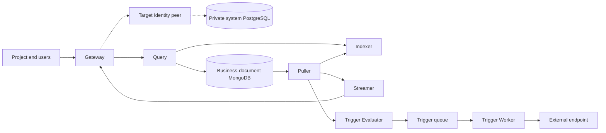

# Design Documents

Designs are organized by [server](server/), [SDK](sdk/), and
[monitoring](monitor/). [Platform Architecture](../architecture.md) owns the
accepted user domains, service boundaries, instance hierarchy, and database
terminology. Design status distinguishes that target from proposed mechanisms
and currently implemented contracts.

## Architecture Owners

| Subject | Owner |
|---|---|
| Employees, developers, end users; Management, Console, instances | [Platform Architecture](../architecture.md) |
| Developer-facing Console and its current embedded UI | [Console design](server/console/01.console.md) |
| Employee-facing Management platform | [Management design](server/console/02.control_plane.md) |
| Runtime services within one Syntrix instance | [Instance architecture](server/01.architecture.md) |
| Project end-user realms, OAuth/OIDC, external login | [Identity design](server/core/identity/01.architecture.md) |
| Business-document CEL rules and evaluation | [Gateway authorization](server/gateway/authorization.md) |
| Instance system metadata and logical database lifecycle | [Database design](server/core/database/01.architecture.md) |
| Private system PostgreSQL and business-document MongoDB | [Storage design](server/core/storage/01.architecture.md) |

A developer can own multiple instances. Every instance owns its projects, and a
project has one isolated Identity realm and can use multiple logical Syntrix
databases. Employee, developer, and application-user authority remain distinct.
The source package layout does not prove these service separations are already
implemented; the platform document's status table identifies the current gaps.

## Writing and Decision Ownership

Describe component responsibilities, contracts, data flows, and failure behavior.
Explain Why alongside How so a reader can assess the mechanism. Detailed
alternatives, trade-offs, and historical decisions belong in an
[Agent Note](../../.agents/notes/README.md), linked from the relevant discussion.

Keep affected designs synchronized with implementation in the same change.
Rewrite documents coherently and reconcile conflicting statements.
Execution plans remain in `docs/plans/`, and the [task board](../tasks/BOARD.md)
tracks work. Use [prose-standard](../../.agents/skills/prose-standard/SKILL.md)
when editing prose and preserve the complete behavior being described.

## Instance Runtime Overview

This is an instance-runtime diagram. Management and the developer Console sit at
the platform layers described by the canonical architecture. Identity is the
target peer module; current authentication is embedded under `core/identity`.
PostgreSQL stores private instance system records, while MongoDB holds developer
business documents. Current code still stores revocation in MongoDB.

Standalone uses direct calls and in-memory trigger pubsub. Distributed mode uses
service clients and NATS JetStream for trigger delivery. These modes apply within
an instance; the [deployment design](server/03.deployment_modes.md) owns their
configuration and lifecycle.
