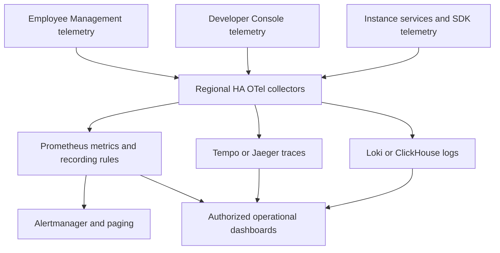

# Monitoring and Observability Architecture

Status: proposed cross-product pipeline; current runtime metrics remain partial.

## Scope and authority

The [system architecture](../../architecture.md) and
[boundary decision](../../../.agents/notes/proposed/architecture/2026-10-10-platform-console-instance-boundaries.md)
separate employee Management, developer Console, and instances serving
application users. Monitoring follows these product authorities while retaining
shared operational correlation. A process `services.Manager` only assembles
instance services; it is not the employee monitoring platform.

Instance runtime telemetry covers Gateway, Query, Identity, Indexer, Puller,
Streamer, Trigger, MongoDB business documents, and private PostgreSQL system
data. Projects and their identity realms belong to instances, and each project
can own multiple logical databases. Current global users/JWTs, embedded console,
and Mongo revocation storage remain implementation gaps against this target.

## Why a shared pipeline

OpenTelemetry instrumentation and common schemas make traces/logs/metrics
joinable. Specialized backends retain appropriate indexing and retention.
Bounded buffering and fail-open export keep a telemetry outage from blocking
application traffic. Shared transport does not imply shared data access.

## Context and scope

Resources identify service, environment, region, version, and the emitting
process. Instance identity applies to instance work; project identity applies to
project/realm work; database identity applies to database work. A fleet scheduler
or developer account request has its own scope and may lack database context.
Collectors validate the operation's actual scope instead of rewriting missing
identifiers into a default database.

Propagate W3C context over HTTP/gRPC/realtime and SDK requests. Request IDs,
query-plan IDs, and authorized principal identifiers belong to logs/traces when
applicable. Metric labels use bounded route/status/operation dimensions and
controlled resource slices; document/user/request IDs do not become labels.

## Pipeline components

Use at least two regional collectors with batching, attribute validation,
redaction, bounded queues, and error/latency tail sampling. Per-instance/project/
database quotas apply at their respective scopes. Route OTLP metrics to
Prometheus remote-write, traces to Tempo/Jaeger, and logs to the selected
structured-log backend. Histograms and exemplars support cross-instance
aggregation and trace drill-down.

Traces target 7–14-day retention; selected error indexes may retain 30 days. Logs
target 14–30 days plus archive. Prometheus recording rules produce SLO windows.
Alertmanager templates include owner/runbook, recent deploy, relevant resource
scope, endpoint/error context, and exemplar links.

## Views and SLOs

Employee Management needs fleet scheduling, resource health, capacity, and
operational rollups. Developer Console needs views for owned/delegated instances
and their project/database slices. Application telemetry access remains under
instance authority; telemetry products do not confer document access.

Service views show RED/USE, dependency health, and deployments. Targets include
API 99.9%, realtime 99.5%, CRUD p95 below 200 ms, query p95 below 400 ms,
replication lag p95 below 5 seconds, and trigger dispatch success above 99%.
Examples page on 2h/6h burn above 14x and warn on 1h/24h above 2x. Every paging
rule requires an owning team and a runbook; incident timelines link signals.

## Deployment and failure behavior

Dev/stage/prod have environment-specific sampling and alert controls. Collectors
use autoscaling and disruption budgets with at least two replicas per region.
Exporter failure retains only bounded data, records drops/backlogs, and leaves
application paths running. Collector outage retries bounded local batches;
backend outage reduces optional sampling and alerts its owners. Cardinality
violations drop offending labels/signals with counters, and sampling mismatch is
measured against request rate.

## Delivery and unresolved decisions

Introduce core API/Query/SDK instrumentation and a staging collector, then cover
storage, Identity, trigger, replication, dashboards, and exemplars. Validate
schema/authority boundaries before production regional rollout, resource caps,
and burn-rate paging. These are future deliveries, not features installed by
the development Compose stack.

Choose Loki versus ClickHouse through retention/cost measurement. Console
integration, authorized custom SLOs, and customer-owned telemetry export remain
open. Dedicated-instance export must preserve instance ownership and avoid
sending unrelated platform/developer telemetry.
