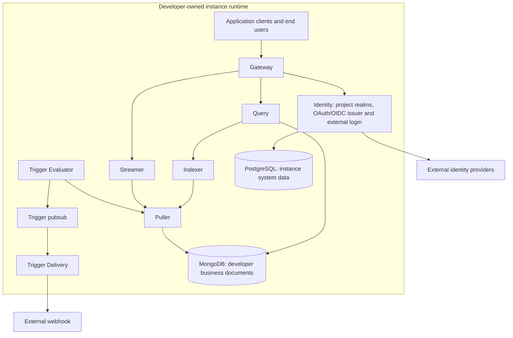

# Syntrix Instance Runtime Architecture

**Updated:** October 10, 2026
**Status:** Accepted target boundaries; runtime implementation is partial

## 1. Product and Runtime Boundaries

The [system architecture](../../architecture.md) owns the product model. The
[boundary decision](../../../.agents/notes/proposed/architecture/2026-10-10-platform-console-instance-boundaries.md)
records the accepted direction and its unimplemented work.

| Component | Audience | Responsibility |
|---|---|---|
| Management platform | Syntrix employees | Platform scheduling, monitoring, and operations across managed instances |
| Console service | Developers | Create and manage one or more developer-owned Syntrix instances |
| Instance runtime | Application end users | Serve an application's identity and data operations |

Management and the developer Console operate outside instance runtimes. Each
instance contains Syntrix runtime services, MongoDB, and PostgreSQL. Each instance
owns projects; each project has an isolated enduser identity realm and can use
multiple logical Syntrix databases. A logical database is a data namespace within
this hierarchy, not an instance or an identity realm.

These ownership boundaries prevent platform operations, developer administration,
and application login from sharing an implicit authority. Application end users
interact with their project's runtime through application clients, not a shared
enduser Console portal.

## 2. Target Instance Components



Identity is a peer runtime module alongside Indexer and Puller. It owns both the
instance's OAuth/OIDC issuer capability and login through external identity
providers, scoped to a project's enduser realm. An external provider does not
replace the instance's issuer responsibility. This diagram defines ownership;
it does not specify new transports, endpoints, or protocol flows.

Instance PostgreSQL owns system data: projects, end users, OAuth/provider/client
configuration, sessions, and logical-database configuration and metadata.
MongoDB owns developer business documents. Authorized system operations access
the private PostgreSQL records; logical-document APIs do not expose them. Deleting
one logical database does not delete its project's shared enduser realm. Platform
Management storage and Console account protocols require separate decisions;
instance PostgreSQL is not a platform-wide control-plane backend.

## 3. Current Implementation

The current Go runtime is a splittable monolith. Runtime services can run together
with direct calls or use gRPC clients in distributed mode. The source locations
below describe today's implementation, not the complete target hierarchy.

| Module | Source | Current responsibility |
|---|---|---|
| Gateway | `packages/syntrix/internal/gateway/` | REST, WebSocket, and SSE entry points, Bearer/context authentication adapters, and document-policy evaluation |
| Query | `packages/syntrix/internal/query/` | CRUD, query planning, and execution |
| Indexer | `packages/syntrix/internal/indexer/` | Stateful query indexes fed by Puller |
| Puller | `packages/syntrix/internal/puller/` | Capture, buffer, replay, and fan out MongoDB changes |
| Streamer | `packages/syntrix/internal/streamer/` | Route matching realtime events and replica change notifications |
| Trigger Evaluator | `packages/syntrix/internal/trigger/evaluator/` | Evaluate rules and publish delivery tasks |
| Trigger Delivery | `packages/syntrix/internal/trigger/delivery/` | Consume tasks and deliver webhooks |
| Identity contracts | `packages/syntrix/internal/identity/` | Transport-free account/verifier/issuer capabilities, safe user views, and opaque verified identities |
| Identity implementation | `packages/syntrix/internal/core/identity/authn/` | Account service, user-token signer, and system-token issuer; repository/runtime extraction remains pending |
| Storage | `packages/syntrix/internal/core/storage/` | Document, user, and revocation storage assembly |
| Logical databases | `packages/syntrix/internal/core/database/` | Current database metadata and lifecycle |
| PubSub | `packages/syntrix/internal/core/pubsub/` | In-memory or NATS-backed trigger transport |
| gRPC server | `packages/syntrix/internal/server/` | Runtime service registration |
| `services.Manager` | `packages/syntrix/internal/services/` | Process dependency injection, startup, and shutdown |

`services.Manager` is an in-process lifecycle component, not the Management
platform. The existing `packages/console` UI is embedded instance administration;
it does not implement the independent developer Console service.

Gateway's [document authorization](gateway/authorization.md) owns the CEL engine,
rule configuration, and evaluation types. Manager constructs it with Query
separately from Identity authentication and consumes `GatewayConfig.AuthZ`.
Rule configuration lives under YAML `gateway.authz`; Identity owns its account
and bootstrap configuration. Each module applies its configuration lifecycle,
and root runtime configuration references those module types. This ownership
separation preserves rule and transport behavior; it does not add project
admission or complete the peer Identity service.

[Identity contracts and Gateway authentication](../../../.agents/notes/implemented/architecture/2026-10-10-identity-contracts-and-gateway-authentication.md)
separate account operations, token verification, and service-token issuance from
HTTP Bearer/context handling. Administrative user list/update validates an opaque
identity from the account service's verifier and its existing exact admin/system
roles. REST retains existing user JSON with empty credential fields while account
contracts return safe noncredential views. Realtime and Trigger Delivery receive
only their respective verifier or issuer capabilities.

[Token capabilities](../../../.agents/notes/implemented/architecture/2026-10-10-identity-token-capabilities.md)
separate the concrete account service, user-token signer, system-token issuer,
and public-material-only verifier. Manager shares one verifier between account
administration and Gateway. Current API/Trigger Worker assembly still loads the
configured private key for local issuing capabilities; key distribution,
repository ownership, and independent runtime placement remain pending.

Current users and authentication are not separated into developer accounts and
project-local end users. User data and logical-database metadata use PostgreSQL,
while revocation storage uses MongoDB. Projects, isolated project realms, and the
target OAuth/OIDC issuer and external-provider login capabilities are not
implemented. Existing database-scoped routes and ownership metadata do not
establish the target's end-to-end isolation guarantee.

## 4. Current Data Paths

```text
CRUD: application client -> Gateway -> Query -> document storage -> MongoDB
Query: application client -> Gateway -> Query -> Indexer
Realtime: MongoDB change stream -> Puller -> Streamer -> Gateway -> client
Trigger: MongoDB change stream -> Puller -> Evaluator -> pubsub -> Delivery -> webhook
```

Puller provides the shared captured event source for Indexer, Streamer, and
Evaluator. Its buffering, replay, and progress rules remain owned by the
[Puller architecture](puller/01.architecture.md). Standalone trigger delivery uses
in-memory pubsub; distributed delivery uses NATS JetStream. Realtime and private
replica transport contracts remain in their component documents.

MongoDB's document model and change streams support business-document operations
and their event capture. Keeping system data in instance PostgreSQL establishes
a separate owner for project and identity lifecycle. The target storage split
still requires implementation of the missing system-data domains and migration
of current identity storage.

## 5. Runtime Deployment

| Mode | Existing startup | Runtime communication |
|---|---|---|
| Standalone | `--standalone` | Direct in-process service calls |
| Distributed | `--all` or selected service flags | gRPC between applicable services, even in one process |

[Deployment modes](03.deployment_modes.md) describes configuration and commands.
Choosing a process layout does not change instance, project, logical-database, or
identity ownership. Platform membership, scheduling, and desired configuration
are separate proposed [control-plane work](console/02.control_plane.md).

## 6. Component Documents

- [Deployment Modes](03.deployment_modes.md)
- [Developer Console and Current Embedded UI](console/01.console.md)
- [Platform Management Control Plane](console/02.control_plane.md)
- [Indexer Architecture](indexer/01.architecture.md)
- [Puller Architecture](puller/01.architecture.md)
- [Streamer Architecture](streamer/01.architecture.md)
- [Trigger Architecture](trigger/01.architecture.md)
- [Identity Architecture](core/identity/01.architecture.md)
- [Storage Architecture](core/storage/01.architecture.md)
- [Gateway REST API](gateway/restful_api.md)
- [Gateway Document Authorization](gateway/authorization.md)
- [Gateway Realtime](gateway/realtime_watching.md)
