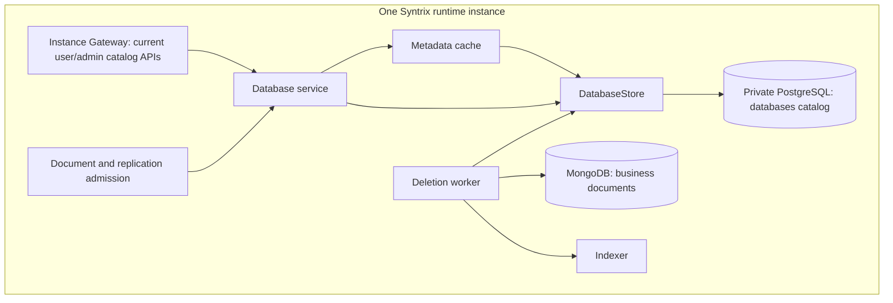

# Instance Database Catalog and Lifecycle

**Status:** Accepted platform boundaries; current database implementation and remaining integration work are distinguished below.
**Scope:** Logical Syntrix database metadata, authorization, validation, bootstrap, and deletion inside one runtime instance.

## 1. Platform, Console, and Instance Ownership

The [platform architecture](../../../../architecture.md) defines three services
with separate audiences:

| Service | Audience | Database responsibility |
|---|---|---|
| Platform Management | Syntrix employees | Platform scheduling, monitoring, resource management, and lifecycle coordination |
| Console | Developers | Developer accounts, instance ownership, and the entry point for creating and managing one or more instances and their resources |
| Syntrix runtime instance | Application end users | Project-scoped identity and document access; local execution of catalog and data operations |

A developer owns one or more instances. Every instance contains Syntrix
services, MongoDB, and PostgreSQL. Projects belong to the instance; one project
can use multiple logical Syntrix databases and has its own end-user identity
realm. Project and database metadata belong to the instance's private
PostgreSQL system database. Console and Management coordinate authorized
operations without becoming the owners of this local catalog.

PostgreSQL is infrastructure used by Syntrix for projects, users, OAuth state,
authentication configuration, database configuration, and lifecycle metadata.
A logical Syntrix database is the developer-facing document product, whose
business documents are stored in MongoDB. Neither the PostgreSQL database nor
a physical MongoDB database name is a logical Syntrix database.

Instance Identity owns end-user accounts and authentication, including issuing
OAuth/OIDC credentials and federating external login. It is a peer of Indexer
and Puller. Its user administration is separate from developer accounts in
Console, employee accounts in Management, and database lifecycle execution.
See the [boundary decision](../../../../../.agents/notes/proposed/architecture/2026-10-10-platform-console-instance-boundaries.md).

## 2. Current Implementation and Accepted Target

The current runtime already implements database metadata CRUD, owner-filtered
listing, configurable creation limits, default database bootstrap, cached
identifier resolution, status validation, and a background deletion worker.
The catalog is PostgreSQL-backed. The earlier absence of registration and
lifecycle operations describes the system before this module was implemented.

Current code still combines account and resource management within an
instance-wide identity namespace. Its `owner_id` refers to the instance user
ID used by the existing API, and instance admin tokens can administer the
catalog. These are current contracts, not the accepted Console developer
identity model. The schema has no project field; the APIs do not yet provide
project scoping or the Console-to-Management operation protocol.

The accepted target separates these authorities:

- Console authenticates the developer and checks instance ownership.
- Management schedules and coordinates the authorized platform operation.
- The selected instance executes local metadata and data operations.
- Instance Identity authenticates end users in the selected project's realm.
- Data services apply project/database binding and application permissions.

An application end-user credential does not inherently grant developer or
employee resource-management authority. Existing `owner_id`, `roles`, and
`db_admin` values cannot establish the three new account categories or project
membership without an explicit migration decision.

## 3. Current Runtime Components



The Go `services.Manager` assembles services inside an instance. Its name does
not refer to the employee-facing platform Management service.

### 3.1 Catalog Entity

The [current entity](../../../../../packages/syntrix/internal/core/database/types.go)
contains `id`, optional `slug`, `display_name`, optional `description`,
`owner_id`, creation/update timestamps, `max_documents`, `max_storage_bytes`,
and `status`. The two limits are stored metadata; their presence does not
establish document count or byte enforcement.

| Identifier | Current format | Meaning |
|---|---|---|
| Metadata `id` | 16 lowercase hexadecimal characters, generated from `hex(blake3(uuid())[:8])` | Immutable catalog primary key |
| Metadata `slug` | Optional, 3–63 characters, `^[a-z][a-z0-9-]{2,62}$` | URL-friendly catalog identifier; immutable once set |
| Document namespace | Database argument passed to document services | Data routing, document predicates, keys, and index scope |
| Physical backend name | Deployment configuration | MongoDB connection and physical database/collection placement |

Slug uniqueness currently covers the whole catalog, not a project. Regular
instance users cannot create the reserved slugs `default`, `admin`, `system`,
`api`, or `auth`; the instance admin path can use reserved slugs after format
validation. ID access uses `id:<id>`; a value without that prefix resolves as
a slug.

Catalog resolution does not automatically rewrite the document namespace.
Existing ordinary document operations may carry the raw slug or `id:` path
value downstream. Bound replication has its own identity contract. Any
canonicalization or project-scoped namespace change must account explicitly
for persisted keys, indexes, bindings, and checkpoints; this document does not
claim that migration has happened.

### 3.2 PostgreSQL Placement

The current factory creates the catalog store on the PostgreSQL connection used
for the user store. The `databases` table has no foreign key to `auth_users`.
This is an existing schema choice; it does not place catalog ownership in
Console or create cross-platform user identities. Table/schema setup shares
the coordinated [PostgreSQL initialization protocol](../storage/06.user-store-postgres.md#7-schema-initialization).

`storage.databases` configures document backend routing. It is separate from
the PostgreSQL catalog and does not register a catalog row or create a project.
See [multi-database storage](../storage/05.multi-database.md).

### 3.3 Current Configuration

```yaml
database:
  max_databases_per_user: 10
  cache:
    enabled: true
    size: 1000
    ttl: 5m
    negative_ttl: 1m
  deletion:
    enabled: true
    interval: 5m
    batch_size: 100
    max_batches_per_cycle: 10
```

These are [runtime configuration defaults](../../../../../packages/syntrix/internal/core/database/config.go).
`max_databases_per_user: 0` disables the count limit; it does not disable
creation. Instance admins bypass this existing limit. Deleting rows still
count until hard deletion. This per-instance-user policy must be revisited
when developer/project management is implemented; it is not a Console quota.
The low-level cache constructor separately defaults a missing negative TTL to
30 seconds. Current service assembly passes only the count limit into
`ServiceConfig`, so it uses those constructor defaults rather than forwarding
the YAML cache settings. Configuration fields describe today's implementation, not a
future platform billing or project quota policy.

## 4. Current Service and Store Contracts

The [service interface](../../../../../packages/syntrix/internal/core/database/service.go)
provides `CreateDatabase`, `ListDatabases`, `GetDatabase`, `UpdateDatabase`,
`DeleteDatabase`, `ResolveDatabase`, `ResolveDatabaseAuthoritative`, and
`ValidateDatabase`.

Management methods take an instance user ID and an admin flag supplied by the
current authenticated Gateway. Non-admin listing forces the owner filter;
get, update, and delete check ownership. Admin creation can select `owner_id`
and settings. Non-admin creation uses the caller's ID. The service does not
validate that an admin-supplied owner exists.

The [store interface](../../../../../packages/syntrix/internal/core/database/store.go)
provides CRUD by metadata ID, lookup by slug, paginated listing with owner and
status filters, owner counting, existence checking, and resource close.
`Exists` checks whether the row exists with active status. `ResolveDatabase` checks
status after cached resolution; `ResolveDatabaseAuthoritative` bypasses the
cache and checks the same status directly in the store.

| Condition | Current error |
|---|---|
| Missing catalog row | `ErrDatabaseNotFound` |
| Suspended row | `ErrDatabaseSuspended` |
| Deleting row | `ErrDatabaseDeleting` |
| Non-owner management request | `ErrNotOwner` |
| Creation count limit | `ErrQuotaExceeded` |
| Protected default deletion | `ErrProtectedDatabase` |
| Invalid/reserved/duplicate/immutable slug | Dedicated slug validation errors |

HTTP translation and payload shapes are described in [the API document](02.api.md).

## 5. Current Operation Flows

### 5.1 Create and Update

Creation validates the display name and optional slug, determines the current
instance owner, checks the non-admin count limit, generates an ID, and inserts
the PostgreSQL row. Success seeds the local cache and clears matching negative
entries. The owner-count check and insertion are separate store calls; the
API does not promise a transactionally serialized concurrent quota check.

Updates preserve ID and owner. A slug can be added only when absent. Instance
admin requests can change status and settings; the service accepts the known
status enum, including `deleting`. Success invalidates local cache entries.

### 5.2 Suspend and Delete

Suspension changes catalog status without removing documents. Deletion first
checks current ownership/admin authority and the protected `default` slug,
then writes `deleting`, invalidates the local cache, and returns. HTTP success
means deletion was initiated, not that all data has been removed.

The worker deletes documents in bounded batches, checks for remaining data,
optionally invalidates Indexer state, and finally hard-deletes metadata. Its
current limitations, retry behavior, namespace assumptions, and slug release
are specified in [the lifecycle document](05.lifecycle.md).

### 5.3 Cache and Admission

The cache holds metadata by ID, slug-to-ID mappings, and negative results by
prefixed lookup key. It uses mutex-protected maps and TTL/expiry-based eviction;
it is not an LRU cache. Local invalidation does not broadcast changes to other
API processes. An authoritative resolver exists for flows that need an
uncached status/identity decision. Admission and realtime handling must
preserve the distinct [document integration contracts](04.integration.md).

### 5.4 Default Database Bootstrap

`services.Manager.Init` initializes authentication, ensures the configured
instance admin user, then invokes the default database bootstrap before
assembling standalone/distributed services. The
[bootstrap helper](../../../../../packages/syntrix/internal/core/database/bootstrap.go)
creates a generated metadata ID with slug `default` owned by that configured
instance admin. It accepts a concurrent creator's duplicate result.

No configured admin username or a missing admin user causes the helper to skip
creation; other lookup/storage errors propagate. The existing default row is
not a project and its bootstrap owner is not a platform employee account.

## 6. Authorization and Integration Gaps

Current catalog ownership, document `db_admin`, and application document rules
serve different purposes. Ownership checks in catalog CRUD do not by
themselves prove document-wide authorization or complete Query enforcement.
See [integration](04.integration.md) for the existing paths and limitations.

The target must separate developer management authority from project end-user
identity, bind each logical database to its project, and preserve document
permissions for that project's users. This requires a reviewed schema/API
and migration design. Project fields, Console routes, service credentials,
revocation timing, and data-namespace migration are not specified as already
implemented here.

Additional lifecycle decisions remain open: ownership transfer, recovery of a
deleting database, document/storage usage enforcement, and coordination with
all retained consumers during deletion. Existing schema and cleanup code
must not be treated as proof these policies are decided.

## 7. Validation Requirements

Existing catalog validation covers store CRUD, identifier/slug rules, cache
hit/miss/invalidation, bootstrap, owner/admin checks, count limits, status
resolution, and worker retry/finalization. End-to-end tests must account for
namespace choice, concurrent writes and quota checks, suspended/deleting
admission, stale caches across processes, large cleanup jobs, and slug reuse.

Future project-aware validation must show that two projects cannot share
end-user authority accidentally, one project can use multiple databases, and
Console/Management operations execute only in the selected owned instance.
Documentation of that target is not evidence those checks have passed.

## 8. Related Documents

- [API contracts](02.api.md)
- [PostgreSQL catalog schema](03.schema.md)
- [Document integration](04.integration.md)
- [Lifecycle and cleanup](05.lifecycle.md)
- [Multi-database storage](../storage/05.multi-database.md)
- [Instance authorization](../identity/03.authorization.md)
