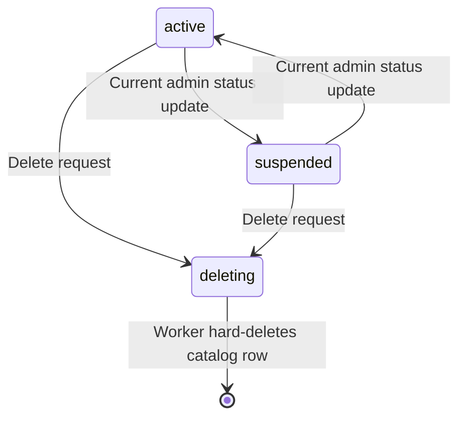

# Instance Database Lifecycle: Suspend and Delete

**Status:** Current catalog/worker behavior and accepted platform ownership; complete project-aware cleanup coordination remains design work.
**Scope:** Availability changes and asynchronous cleanup for a logical database inside one runtime instance.

## 1. Lifecycle Authority

The [platform architecture](../../../../architecture.md) distinguishes Console
developers, Management employees, and project end users. Console is the
developer-facing management entry. Management schedules and coordinates
authorized platform lifecycle operations. The selected Syntrix instance owns
and executes local catalog and data changes; its private PostgreSQL stores
project/database configuration and lifecycle state, while MongoDB stores
business documents.

Projects belong to an instance and each project has an isolated end-user realm
shared by its multiple logical databases. Instance Identity owns end-user
accounts and OAuth/OIDC, as a peer of Indexer and Puller. Deleting a logical
database is not deleting a project, its identity realm, the instance, or a
Console developer/Management employee account. Those are separate lifecycle
operations with different authority and data scope.

The current instance API uses instance user ownership and instance admin
roles. The schema has no project field, and the Console-to-Management protocol
is not implemented here. The current Go `services.Manager` is runtime service
assembly, not the employee-facing Management platform.

## 2. Current Status and Admission



| Catalog status | Existing validator response | Data consequence |
|---|---|---|
| `active` | Admission continues | Normal document processing, subject to each route's authentication/authorization |
| `suspended` | 403 `DATABASE_SUSPENDED` | Documents remain in storage |
| `deleting` | 410 `DATABASE_DELETING` | Cleanup is pending or underway |

These status responses apply where the validator is configured. Cached
resolution, already-admitted requests, and long-lived sessions have their own
limits; see [document integration](04.integration.md). A PostgreSQL status
write is not a global write barrier or immediate revocation guarantee.

The state diagram describes intended ordinary transitions. Current admin
updates accept any known status enum, including `deleting`; the service does
not enforce a terminal state machine or forbid a later update out of
`deleting`. This is not a promise of recoverable deletion.

## 3. Current Suspend and Resume Operations

The current instance admin API changes the catalog status:

```http
PATCH /admin/databases/my-app-prod
Content-Type: application/json
Authorization: Bearer <instance-admin-token>

{"status":"suspended"}
```

Use `{"status":"active"}` to resume. The identifier can also be
`id:a1b2c3d4e5f67890`. The service updates PostgreSQL and invalidates its local
positive cache entries. Suspension does not delete documents or Indexer state.
Maintenance or policy-driven suspension must use separately authorized
Console/Management coordination in the accepted target; this current endpoint
is not an employee platform API.

## 4. Current Delete Request and Slug Lifetime

The existing API permits owner deletion through
`DELETE /api/v1/databases/{identifier}` and instance admin deletion through
`DELETE /admin/databases/{identifier}`.

The [service](../../../../../packages/syntrix/internal/core/database/service.go)
resolves the row, checks current caller ownership/admin authority, rejects the
protected `default` slug, writes `deleting`, and invalidates local positive
cache entries. Catalog protection uses the slug, not the generated ID.
Repeated accepted requests can write `deleting` again; the HTTP response does
not wait for cleanup.

```json
{
  "id": "a1b2c3d4e5f67890",
  "slug": "my-app-prod",
  "status": "deleting",
  "message": "Database deletion initiated"
}
```

`200 OK` means initiation. Owner rejection is 403 `FORBIDDEN`; protected
default deletion is 400 `PROTECTED_DATABASE`. Current status validation
rejects admitted data operations with the errors in Section 2.

The slug remains reserved while the catalog row exists, including `deleting`.
Hard deletion removes the uniqueness reservation and permits reuse. A reused
slug identifies a new metadata incarnation; bound clients must preserve
[database identity checks](../../gateway/replication.md). Slug release is not
proof that every old document namespace or retained consumer was cleaned.

All rows, including deleting rows, count toward the current instance-user
creation limit until hard deletion. This prevents a deleting row from
immediately freeing the current count allowance. It is not a decided project,
instance, or Console billing policy.

## 5. Current Background Worker

### 5.1 Scheduling and Bounds

The [DeletionWorker](../../../../../packages/syntrix/internal/core/database/deletion_worker.go)
starts an immediate cleanup cycle, then repeats on its configured interval.
It lists at most 100 deleting rows per cycle. Per database it deletes bounded
batches, with `MaxBatchesPerCycle` preventing one job from monopolizing the
cycle. Defaults are:

```yaml
database:
  deletion:
    enabled: true
    interval: 5m
    batch_size: 100
    max_batches_per_cycle: 10
```

The API returns quickly because cleanup can take many cycles. A canceled
worker stops processing; deleting metadata remains available for another
cycle/restart to discover. Document or metadata failures are logged and leave
the row for later retry where the worker has not already finalized it.

### 5.2 Data Removal and Finalization

For each row, the worker currently:

1. Calls `DocumentStore.DeleteByDatabase(ctx, db.ID, batchSize)` for the
   configured number of batches, stopping earlier on a short batch.
2. Calls the same method with limit 1 to probe for remaining data. This probe
   can itself delete one document. A positive count defers finalization to a
   later cycle.
3. Calls optional Indexer invalidation using `db.ID`.
4. Hard-deletes the PostgreSQL metadata row.

The [Mongo implementation](../../../../../packages/syntrix/internal/core/storage/mongo/document_store.go)
physically deletes matching documents from the configured ordinary and system
collections, sharing the supplied batch limit across both. It propagates
find, decode, cursor, and delete failures. Physical removal is separate from
ordinary logical document deletion and its tombstone/Watch behavior; see
[storage deletion semantics](../storage/03.stores.md#document-deletion-and-physical-cleanup).

### 5.3 Existing Cleanup Limits

The worker uses the metadata ID as its document and Indexer namespace. Ordinary
HTTP document paths can retain the raw slug or `id:` value. Those namespaces
are not interchangeable. The current worker cannot be assumed to clean every
namespace that a caller has used for the same catalog row.

Indexer invalidation is optional. An invalidation error is logged, but the
worker still proceeds to hard-delete metadata. There is no persisted progress
ledger coordinating all Query, Puller, Streamer, evaluator, trigger, replica,
and retained-history state. The current implementation therefore does not
establish complete cross-service cleanup or a barrier against stale writes
and consumers before slug release.

These are implementation limits to address through lifecycle design. A
rewritten namespace or stronger cleanup guarantee must be delivered with
its corresponding migration and service coordination; architecture prose
cannot supply them.

## 6. Runtime Assembly and Shutdown

The current
[instance service assembly](../../../../../packages/syntrix/internal/services/manager_init.go)
creates the catalog service for API/Gateway roles and the deletion worker for
Query roles when enabled. It obtains the metadata and document stores from
the borrowed document/catalog factory and passes the available Indexer invalidator.
Physical Backends remains owned by Manager and is closed only after consumers
stop; deletion-worker cleanup does not close that shared connection.
The default database bootstrap runs during instance initialization as described
in [catalog architecture](01.architecture.md#54-default-database-bootstrap).

Worker `Start` launches its loop once; `Stop` cancels it and waits up to the
caller's context deadline. The runtime startup/shutdown composition owns
when those methods and provider closes are called. This is process lifecycle
inside an instance, separate from platform Management provisioning/removal
of an entire instance.

## 7. Accepted Target and Open Lifecycle Decisions

Developer resource operations enter through Console, are coordinated by
Management when platform scheduling/lifecycle execution is required, and are
executed locally in the selected instance. The catalog and lifecycle state
stay in instance PostgreSQL. End-user OAuth permissions do not inherently
authorize that control path.

Required document and index cleanup must finish successfully before metadata
is hard-deleted and the slug is released for reuse. A failed document deletion
or required index invalidation must retain the metadata in `deleting` status
and preserve the slug reservation so cleanup can retry. Deletion is complete
only after the required cleanup and catalog removal succeed. The current
worker's Indexer-error handling in Section 5.3 does not satisfy this completion
gate.

A project-aware implementation must explicitly define the database namespace,
project binding, write/subscription admission during lifecycle changes,
cleanup responsibilities, and persisted retry progress. Additional cleanup
participants and coordination transports remain design decisions; they do not
weaken the completion gate above. Project deletion and instance deletion
require separately scoped coordination. Recovery/undo, ownership transfer,
quota authority, backup policy, active-session timing, and revocation SLA
remain decisions;
none are established by the existing worker.

## 8. Validation and Observability Requirements

Existing validation covers status resolution, ownership/admin checks, protected
default deletion, batching, retry on document/store errors, cancellation,
startup, and retained deleting rows. Integration validation must cover large
data sets, concurrent writes, multiple workers, namespace choice, suspension
across cached Gateways, Indexer failure, and metadata/slug reuse. Target
validation must show that required document or index cleanup failure keeps the
row deleting and its slug reserved, and that successful retry releases the
slug only after all required cleanup and catalog removal finish.

The earlier design identified the following useful future metrics; their names
are proposals, not an assertion of instrumentation:

| Proposed metric | Purpose |
|---|---|
| `database_deletions_initiated_total` | Accepted deletion requests |
| `database_deletions_completed_total` | Completed cleanup/finalization |
| `database_deletion_duration_seconds` | Cleanup duration |
| `database_deletion_documents_total` | Removed document count |
| `database_suspensions_total` / `database_resumptions_total` | Availability changes |

Current logs report database metadata ID/slug, batch progress, failures, and
completion. Future platform dashboards need authorized instance/project
summaries; raw end-user identities and unbounded logical database names must
not become an accidental platform-wide metric dimension policy.

## 9. Related Documents

- [Catalog architecture](01.architecture.md)
- [Existing catalog APIs](02.api.md)
- [PostgreSQL schema](03.schema.md)
- [Document integration](04.integration.md)
- [Multi-database namespaces and Watch](../storage/05.multi-database.md)
