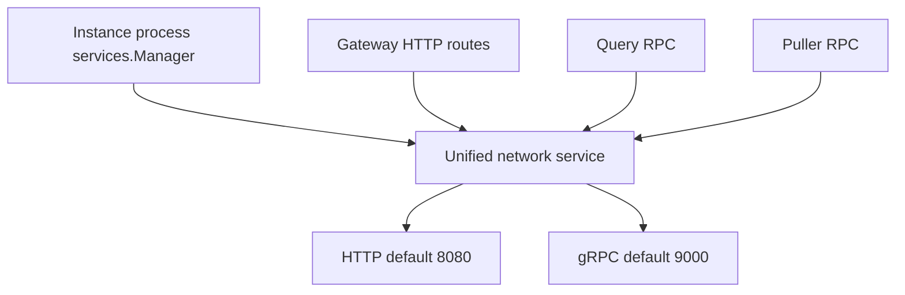

# Unified Instance Server Architecture

Status: implemented network layer; platform products and project realms are target architecture.

## Responsibility

`packages/syntrix/internal/server` centralizes listener creation, middleware, and
network lifecycle for the Go instance process. Gateway and runtime RPC services
register with this package before startup. Shared configuration reduces timeout
and shutdown divergence without moving business authorization into transport
code.

The [system architecture](../../../architecture.md) and
[boundary decision](../../../../.agents/notes/proposed/architecture/2026-10-10-platform-console-instance-boundaries.md)
place employee Management above the fleet, a separate developer Console above
owned instances, and application services inside each instance. The process
`services.Manager` is dependency injection and lifecycle assembly. It does not
schedule the platform or authenticate platform employees/developers.

## Registration and listeners

Construction initializes the router, gRPC registration surface, and configured
limiters. It does not open sockets. Registration completes before `Start` opens
HTTP and gRPC listeners. A process can host several runtime services; distributed
service processes retain their own listener configuration. Ports are process
configuration, not identifiers for Console or Management products.

Instance Identity is a peer runtime service in the accepted target, with
project-isolated realms, an OAuth/OIDC issuer, and external login. Current
JWT-backed authentication is injected into gateway handlers; project realms and
the full issuer/provider flow are not delivered by server registration.

## Middleware ownership

Shared HTTP middleware includes recovery, request IDs, structured logging,
security headers, configurable CORS, and general rate limiting. Module handlers
own authentication, document authorization, request validation, and endpoint
limits. Unary and streaming gRPC interceptors provide recovery and logging.
OpenTelemetry expansion is specified in the [monitoring design](../../monitor/001.architecture.md).

A shared listener does not imply a shared security principal. Employee,
developer, and application token authorities remain distinct. Project/database
correlation is attached to operations that have that scope; listener startup and
fleet operations do not invent database identifiers.

## Lifecycle

1. The process manager constructs the server and runtime dependencies.
2. Modules register HTTP handlers and RPC services.
3. `Start(ctx)` opens listeners and waits for cancellation or a listener failure.
4. The process owner calls `Stop(ctx)` to drain HTTP and gRPC within its shutdown
   budget and release limiter resources.

`Start` cancellation does not replace `Stop`. Shutdown joins HTTP errors and
forces gRPC stop on deadline. Construction, registration, bind failures, and
shutdown have independently testable contracts.

## Source map

| Source | Ownership |
|---|---|
| `config.go` | Listener, timeout, CORS, limiter, reflection, shutdown configuration |
| `interface.go` | Registration and lifecycle surface |
| `service.go` | Construction, startup, shutdown, limiter ownership |
| `http_server.go`, `grpc_server.go` | Protocol listener implementation |
| `middleware.go` | Shared HTTP middleware and gRPC interceptors |
| `global.go` | Default registration facade within the process |

The shared `Service` interface enables transport substitution in tests and keeps
lifecycle implementation encapsulated. The network package remains independent
of runtime query/puller business logic.
